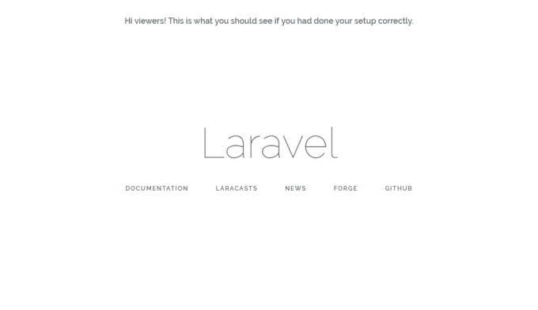
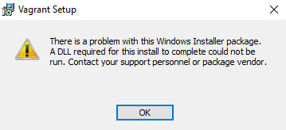

Setting up Laravel had been a pain in the ass for me, since I have not used all these technology stacks before (I'm more familiar with Django and Node.js).

Thus, hopefully, I can help you alleviate your pain.

The image below is what you should see once you have properly setup Laravel + Homestead for both Windows and Mac users.


# Installation

Let's start by going through the lists of things to install:

- Homestead + Vagrant + VirtualBox
- Laravel + Composer

To get Laravel up and running we will need to install Homestead which depends on Vagrant which (again) depends on VirtualBox.

Note: You can use another VM software as listed here on the Homestead installation page, but in this tutorial, I'm using VirtualBox.

## Step 1/5 Virtual Box

So let's go install them according to their dependency. First up, download and install VirtualBox here. (Showing only Windows here)

<!-- Image not found: win_vb1.png -->

There shouldn't be much of an issue installing this. No additional configurations or anything. Press next until you reached the final screen. There isn't a need to start the application either. Sweet.

## Step 2/5 Vagrant

Once you are done, download and install Vagrant [here](https://www.vagrantup.com/downloads.html).


Well for me, I had encountered some issues. The Windows Install package could not run a required DLL. Note: It is fine if you do not see this popup.

Well, the issue was that this setup didn't have the necessary permission. Solution? Open Command Prompt as an administrator (right-click on Command Prompt and select Run as Administrator) and type in this line:

```
msiexec -i "vagrant_1.9.1.msi"
```

Press enter and watch the magic happens.

Note: Your Vagrant installation version might be different, e.g, 1.10.1, so simply update accordingly.

## Step 3/5 Homestead

Now to download the Homestead box. Simply run this line:

```
vagrant box add laravel/homestead
```

This may take a few minutes to complete as Vagrant searches the specified box to download from their public box catalogue.

Once done, we will install Homestead.

Note: The step above was just to install the Homestead box for Vagrant, not the actual Homestead.

Next, navigate to your home directory. We usually use the home directory as it is easier to navigate to and from.

For Windows:

```
cd %userprofile%
```

For Macs/\*nix:

```
cd ~
```

Note: %userprofile% is the Windows equivalent of ~ in \*nix.

Next clone the Homestead git repository:

```
git clone https://github.com/laravel/homestead.git Homestead
```

Now to create and copy some configuration files for Homestead. Navigate to the newly cloned repository, we did this in the above command(named Homestead), and run the init file:

For Windows:

```
init.bat
```

For Macs/\*nix:

```
bash init.sh
```

What did was to copy three configurations files from ~/Homestead/src/stubs over to ~/.homestead directory.
Note: You can see which are the files copied by looking at the source code of the init files.

For the more adventurous, read on how to configure the Homestead.yaml settings here.

With that, we have successfully installed VirtualBox, Vagrant, and Homestead. Phewww...

## Step 4/5 Composer

Composer is the package manager for PHP.

Installation is pretty straightforward. Follow the instructions from their website here.

## Step 5/5 Laravel

Finally, we have reached the final step.

Now to get Laravel. Run this code:

```
composer global require "laravel/installer"
```

Awesome! That's all for the installation.

Creating a test App

Now to create a test app to make sure that everything has been set up right.
Create a folder called Code in your home directory, and navigate to it. Then run this:

```
laravel new Laravel
```

The above line of code creates a new Laravel project named Laravel.
Note: You should now have this file structure:

```
~\Code\Laravel\index.html + other files
```

Before we get our server running, two house-keeping tasks we will have to complete.

First, we will have to make sure our .env file is created. We will navigate to our project folder and make a copy of the .env file:

```
cd ~\Code\Laravel
cp .env.example .env
```

Next, we will need to install all our PHP dependencies. We will let Composer install those for us.

```
composer install
```

With that we can bring up Vagrant. We will navigate to the Homestead directory first then start Vagrant from there:

```
cd ~\Homestead
vagrant up
```

Access your website by going to 192.168.10.10


And that's what you'll see!
