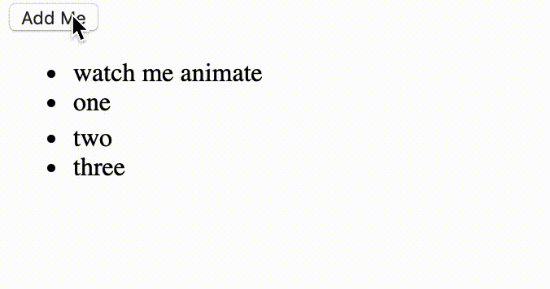

Animation.

One of the most entertaining, and time-consuming, features to implement. The journey is long but rewarding. This story is one that I was tasked to do.

I was working on a list, say a todo list, in which the user can add a new element to the top of the list. Upon inserting, it animate its background from yellow to white.


How this can be done in CSS.

```css
@keyframes fadeyellow {
  0% {
    background: yellow;
  }
  80% {
    background: yellow;
  }
  100% {
    background: initial;
  }
}

li {
  animation-duration: 2.5s;
  animation-name: fadeyellow;
  margin-bottom: 4px;
}
```

However, for React Native, we do not have the luxury of CSS Animations. Thus, needing to rely on our old trusty `Animated`.

```jsx
import { Animated } from "react-native";

class ListItemWithFade extends React.Component {
  constructor(props) {
    super(props);
    this.opacity = new Animated.Value(0);
    this.startAnimation();
  }

  startAnimation() {
    Animated.sequence([
      Animated.delay(2000),
      Animated.spring(this.opacity, {
        toValue: 1,
        duration: 500,
        useNativeDriver: true,
      }),
    ]);
  }

  render() {
    const background = this.opacity.interpolate({
      inputRage: [0, 1],
      outputRange: ["yellow", "transparent"],
    });
    return (
      <Animated.View style={{ background }}>
        {this.props.children}
      </Animated.View>
    );
  }
}
```

// ...

```jsx
const MyList = ({ listItems }) => {
  return (
    <View>
      {listItems.map((item) =>
        item.isAnimating ? <ListItemWithFade /> : <ListItem item={item} />
      )}
    </View>
  );
};
```

When this code is executed, you will observe that the first time we add an item to the list, the animation works.

However, you might also notice something wrong -- props to you if you did!



As the instance of the animation value is created upon class instantiation, the second time we add an item to the list,
its the **second** list item (watch me animate) that instantiates a new `<ListItemWithFade />` object and start the animation.

```jsx
<MyList>
  <ListItemWithFade />
  <ListItem />
  <ListItem />
  <ListItem />
</MyList>

// becomes

<MyList>
  <ListItemWithFade />
  <ListItemWithFade />
  <ListItem />
  <ListItem />
  <ListItem />
</MyList>
```

Thus, in order for us to overcome this, we need to isolate our animated value.
We also need to communicate to the other `<ListItemWithFade />` object that "hey this animation had already begun, please use this value".

In our `<ListItemWithFade />` class, we can add an `opacityMap`, as a static property of ListItemWithFade,
which will keep track of our animation progress.

And when we are rendering, we query for the correct instance of our animation progress.

```jsx
import { Animated } from "react-native";

class ListItemWithFade extends React.Component {
  static opacityMap = {};

  constructor(props) {
    super(props);

    this.startAnimation();
  }

  static getOpacity(key) {
    if (ListItemWithFade.opacityMap[key] === undefined) {
      ListItemWithFade.opacityMap[key] = new Animated.Value(0);
    }

    return ListItemWithFade.opacityMap[key];
  }

  getOwnOpacity() {
    const { key } = this.props;
    return ListItemWithFade.getOpacity(key);
  }

  startAnimation() {
    Animated.sequence([
      Animated.delay(2000),
      Animated.spring(this.getOwnOpacity(), {
        toValue: 1,
        duration: 500,
        useNativeDriver: true,
      }),
    ]);
  }

  render() {
    const background = this.getOwnOpacity().interpolate({
      inputRage: [0, 1],
      outputRange: ["yellow", "transparent"],
    });
    return (
      <Animated.View style={{ background }}>
        {this.props.children}
      </Animated.View>
    );
  }
}
```

And there we have it, a solution to our animation problem!


